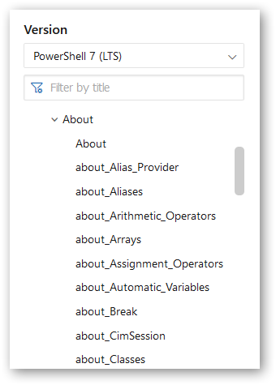

<p align="center"></p>

# PowerShell-CH
🗽 尝试翻译最新版 PowerShell（7.0）文档中的 `Microsoft.Powershell.Core` <u>About</u> 部分。

<p align="center"></p>

内容目录如下所示
```
+--About
   +--about_Alias_Provider
   +--about_Aliases
   +--about_Arithmetic_Operators
   +--about_Arrays
   +--about_Assignment_Operators
   +--about_Automatic_Variables
   +--about_Break
   +--about_Cim
   +--about_Classes
   +--about_Command_Precedence
   +--about_Command_Syntax
   +--about_Comment_Based_Help
   +--about_Common
   +--about_Comparison_Operators
   +--about_Continue
   +--about_Core_Commands
   +--about_Data_Sections
   +--about_Debuggers
   +--about_Do
   +--about_Enum
   +--about_Environment_Provider
   +--about_Environment_Variables
   +--about_Execution_Policies
   +--about_Experimental_Features
   +--about_File
   +--about_For
   +--about_Foreach
   +--about_Function_Provider
   +--about_Functions
   +--about_Functions_Advanced
   +--about_Functions_Advanced_Methods
   +--about_Functions_Advanced_Parameters
   +--about_Functions_Cmdlet
   +--about_Functions_Output
   +--about_Group_Policy_Settings
   +--about_Hash_Tables
   +--about_hidden
   +--about_History
   +--about_If
   +--about_Job_Details
   +--about_Jobs
   +--about_Join
   +--about_Language_Keywords
   +--about_Language_Modes
   +--about_Line_Editing
   +--about_locations
   +--about_Logging_Windows
   +--about_logical_operators
   +--about_Methods
   +--about_Modules
   +--about_Object_Creation
   +--about_Objects
   +--about_Operator_Precedence
   +--about_Operators
   +--about_Package
   +--about_Parameters
   +--about_Parameters_Default_Values
   +--about_Parsing
   +--about_Path_Syntax
   +--about_pipelines
   +--about_PowerShell_Config
   +--about_PowerShell_Editions
   +--about_Preference_Variables
   +--about_Profiles
   +--about_Prompts
   +--about_Properties
   +--about_Providers
   +--about_psconsolehostreadline
   +--about_PSSession_Details
   +--about_PSSessions
   +--about_pwsh
   +--about_Quoting_Rules
   +--about_Redirection
   +--about_Ref
   +--about_Registry_Provider
   +--about_Regular_Expressions
   +--about_Remote
   +--about_Remote_Disconnected_Sessions
   +--about_Remote_FAQ
   +--about_Remote_Jobs
   +--about_Remote_Output
   +--about_Remote_Requirements
   +--about_Remote_Troubleshooting
   +--about_Remote_Variables
   +--about_Requires
   +--about_Reserved_Words
   +--about_Return
   +--about_Run_With_Power
   +--about_Scopes
   +--about_Script_Blocks
   +--about_Script_Internationalization
   +--about_Scripts
   +--about_Session_Configuration_Files
   +--about_Session_Configurations
   +--about_Signing
   +--about_simplified_syntax
   +--about_Special_Characters
   +--about_Splatting
   +--about_Split
   +--about_Switch
   +--about_Telemetry
   +--about_Throw
   +--about_Trap
   +--about_Try_Catch_Finally
   +--about_Type_Operators
   +--about_Updatable_Help
   +--about_Variable_Provider
   +--about_Variables
   +--about_While
   +--about_Wildcards
```

------

<p align="center"></p>
<p align="center">©Copyleft <a href="mailto:jx.zeng.xtu@gmail.com">jx.zeng</a> 2020</p>
